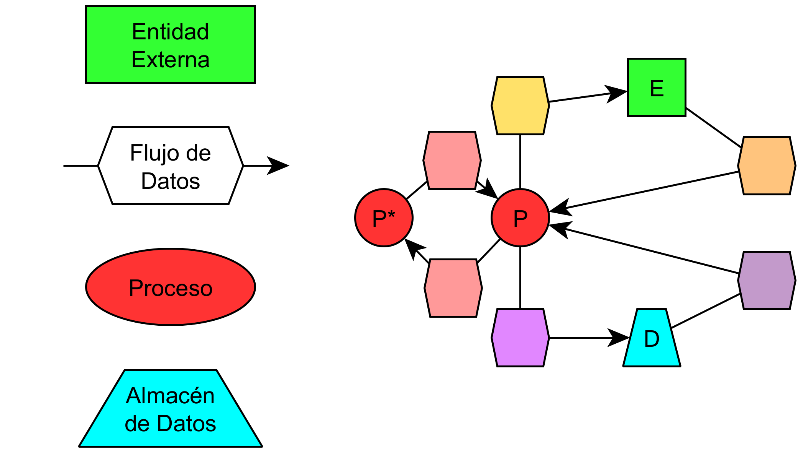

# DFD Maker for yEd - by Cheese Chariot

Herramienta para generar Diagramas de Flujo de Datos (DFD) en formato GraphML compatible con **yEd**, a partir de archivos CSV. Implementa un formato visual personalizado que mejora la legibilidad mediante el uso de colores diferenciados y nodos explícitos para representar flujos de información.

---

## 👤 Autor y Origen

**Autor:** [Emmanuel Nicolás Velásquez Muñoz](https://github.com/XeeseXariot)  
**Institución:** [Universidad de Magallanes](https://www.umag.cl)  
**Departamento:** [Departamento de Ingeniería en Computación](https://dicumag.cl)  
**Programa:** Ingeniería Civil en Computación e Informática  
**Curso:** DSIA1 - Desarrollo de Sistemas de Información 1  
**Docente:** Dra. Patricia Maldonado

### Origen de la herramienta

Esta herramienta nació durante el curso **DSIA1 - Desarrollo de Sistemas de Información 1** en la **Universidad de Magallanes**, dictado por la **Dra. Patricia Maldonado**.

Al trabajar con los formatos tradicionales de DFD, encontré que la representación estándar —con flujos mostrados únicamente como líneas etiquetadas— resultaba poco clara en diagramas con múltiples procesos y conexiones complejas. La ausencia de diferenciación visual dificultaba seguir el recorrido de la información y entender rápidamente el tipo de cada flujo.

Ante esta limitación, y con la autorización de la profesora Maldonado, desarrollé un estilo personalizado que incorpora:

- **Código de colores** para identificar visualmente el tipo de cada flujo
- **Nodos hexagonales explícitos** que contienen la descripción completa de los datos intercambiados
- **Formas diferenciadas** para cada tipo de elemento (círculos, cuadrados, trapecios)

Lo que comenzó como una notación alternativa para mejorar la legibilidad evolucionó naturalmente hacia la automatización. A medida que los diagramas crecían en complejidad, crear manualmente cada elemento en yEd se volvió repetitivo y propenso a errores. Así surgió `csv2dfd_graphml.py`: una herramienta que transforma especificaciones tabulares simples en diagramas GraphML completamente formateados, listos para organizar y exportar.

---

## 📁 Estructura del Repositorio

```
dfd_maker_for_yed/
├── csv2dfd_graphml.py            # Script principal
├── csv/
│   ├── entidades.csv             # Definición de elementos
│   ├── flujo.csv                 # Conexiones entre elementos
│   └── formato.csv               # Estilo personalizado
├── GraphML/                      # Destino predefinido
├── images/
│   └── ElementosDFD-Chariot.png  # Ejemplo del formato
└── README.md                     # El archivo que lees ahora
```

---

## 🎨 Formato DFD Personalizado "DFD-Chariot"

Este generador implementa un esquema visual diseñado para maximizar la claridad en diagramas complejos:

### Elementos del diagrama

- **Procesos:** círculos de color rojo intenso (`#FF3333`)
- **Entidades externas:** cuadrados de color verde brillante (`#33FF33`)
- **Almacenes de datos:** trapecios de color cian puro (`#00FFFF`)
- **Flujos de información:** hexágonos que contienen la descripción detallada de los datos intercambiados

### Código de colores para flujos

Cada flujo se representa mediante un hexágono conectado con una línea continua al emisor y una flecha hacia el receptor. El color del hexágono indica el tipo de intercambio:

| Tipo de flujo                       | Color     | Nombre del color |
| ----------------------------------- | --------- | ---------------- |
| Proceso → Entidad externa           | `#FFE169` | Amarillo dorado  |
| Entidad externa → Proceso           | `#FFC47D` | Naranja suave    |
| Proceso → Almacén de datos          | `#E187FF` | Lila vibrante    |
| Almacén de datos → Proceso          | `#C39ACB` | Lavanda media    |
| Proceso → Proceso                   | `#FF9999` | Rosa claro       |



> **Nota:** Este formato personalizado, denominado **"DFD-Chariot"**, fue diseñado específicamente para este proyecto. Revisando la documentación de yEd sobre el manejo de formatos GraphML, puedes crear tus propios formatos DFD personalizados modificando las formas y colores en el archivo `formato.csv` según tus necesidades.

---

## 📝 Preparación de Archivos CSV

Prepara tus listas pensando "Quién envia Qué a Donde", así lo planifiqué.
  - `El panadero envió pan fresco a inventario de venta"`
  - Respeta el formato ejemplo de la primera linea en los archivos o la herramienta no funcionará.

La herramienta lee tres archivos CSV ubicados en el directorio `csv/`:

### 1. `entidades.csv`
Define procesos, entidades externas y almacenes de datos.
Estos serán los Quién/Donde del flujo.
Quien es el identificador. Nombre es... bueno, el nombre.

**Estructura:**
```csv
quien;"Nombre"
P1;"Nombre del Proceso"
E1;"Nombre de Entidad Externa"
D1;"Nombre de Almacén de Datos"
```

### 2. `flujo.csv`
Especifica las conexiones entre elementos.
Indica el Nivel, Quien envia, a Donde envia y Qué envia.
- Si hay varios envíos de un remitente y destino, lo ideal es separar dentro del mensaje con `;` para generar todos los envios en un único bloque de flujo.

> **⚠️ Advertencia:** Evita usar `"Flujo1 - Flujo2"` ya que es reservado del python en este momento y podría producir problemas de formato. Pronto podría surgir una actualización que cambie como regula el script los envíos largos y múltiples, evitando este y otros errores.

**Estructura:**
```csv
nivel;quien;donde;"Qué"
0;E1;P0;"Descripción del flujo de datos"
1;P1;D1;"Descripción detallada"
```

### 3. `formato.csv`
Configura estilos y colores personalizados.
- `forma` depende de lo disponible en **yEd**
- `color` usa RGB en formato hexadecimal, admite alpha.
 - Debes escribir todos los colores o en mayusculas o en minusculas, sino yEd no interpretará bien el color.

**Estructura:**
```csv
tipo;forma;color;"Descripción"
P;ellipse;#FF3333;"Proceso"
E;rectangle;#33FF33;"Entidad externa"
```

> **Ejemplo incluido:** El repositorio incluye archivos CSV con datos de ejemplo de **"Kiosko Requesón"**, un negocio inventado de venta de quesos y productos lácteos. Estos archivos están listos para que pruebes la funcionalidad del programa sin necesidad de crear tus propios datos inicialmente.

---

## 🚀 Uso de la Herramienta

### Requisitos

- Python 3.9 o superior
- Dependencias estándar de la biblioteca (incluidas por defecto: `argparse`, `csv`, `dataclasses`)
- **yEd Graph Editor** para visualizar y manipular los archivos GraphML generados
  - Descarga gratuita disponible en: https://www.yworks.com/products/yed

### Ejecución

Desde la raíz del repositorio:

**En Windows (PowerShell):**
```powershell
python csv2dfd_graphml.py --nivel 1 --modo full
python csv2dfd_graphml.py --nivel 1 --modo plates
python csv2dfd_graphml.py --nivel 2 --modo full --output DFD-Nivel2.graphml
```

**En Linux/macOS:**
```bash
python3 csv2dfd_graphml.py --nivel 1 --modo full
python3 csv2dfd_graphml.py --nivel 1 --modo plates
python3 csv2dfd_graphml.py --nivel 2 --modo full --output DFD-Nivel2.graphml
```

### Argumentos disponibles

- `--nivel` (obligatorio): nivel del DFD a generar (número entero)
- `--modo` (opcional): 
  - `full` (por defecto): genera un único archivo GraphML
  - `plates`: genera múltiples archivos, uno por proceso más un archivo `Core.graphml` con flujos solo entre procesos del nivel
- `--output` (opcional): ruta de salida personalizada
  - En modo `full`: archivo `.graphml` de destino
  - En modo `plates`: directorio donde se depositarán los fragmentos

### Flujo de trabajo recomendado

1. Editar los archivos CSV en `csv/` con la información del diagrama
2. Ejecutar `csv2dfd_graphml.py` con los parámetros deseados
3. Abrir el archivo GraphML generado en **yEd**
4. Seleccionar todos los elementos (Ctrl+A)
5. Ajustar tamaño de nodo a la etiqueta (Tools → Fit Node to Label) ya que la herramienta lo deja en tamaño estándar
6. Aplicar un layout automático (Layout → Hierarchical u Organic) ya que la herramienta no asigna posiciones manipulables y sobrepone elementos
7. Realizar ajustes visuales finales
8. Exportar a imagen (PNG, SVG, PDF) según necesidad

El archivo generado está listo para ser organizado directamente en yEd sin necesidad de configuración adicional. Todos los estilos, colores y formas están preconfigurados.

---

## 📄 Licencia

Este proyecto está licenciado bajo la **MIT License**.

### MIT License

Copyright (c) 2025 Emmanuel Nicolás Velásquez Muñoz

Se concede permiso, de forma gratuita, a cualquier persona que obtenga una copia de este software y de los archivos de documentación asociados (el "Software"), para utilizar el Software sin restricción, incluyendo sin limitación los derechos a usar, copiar, modificar, fusionar, publicar, distribuir, sublicenciar, y/o vender copias del Software, y a permitir a las personas a las que se les proporcione el Software a hacer lo mismo, sujeto a las siguientes condiciones:

El aviso de copyright anterior y este aviso de permiso se incluirán en todas las copias o partes sustanciales del Software.

EL SOFTWARE SE PROPORCIONA "TAL CUAL", SIN GARANTÍA DE NINGÚN TIPO, EXPRESA O IMPLÍCITA, INCLUYENDO PERO NO LIMITADO A GARANTÍAS DE COMERCIALIZACIÓN, IDONEIDAD PARA UN PROPÓSITO PARTICULAR Y NO INFRACCIÓN. EN NINGÚN CASO LOS AUTORES O TITULARES DEL COPYRIGHT SERÁN RESPONSABLES DE NINGUNA RECLAMACIÓN, DAÑOS U OTRAS RESPONSABILIDADES, YA SEA EN UNA ACCIÓN DE CONTRATO, AGRAVIO O CUALQUIER OTRO MOTIVO, QUE SURJA DE O EN CONEXIÓN CON EL SOFTWARE O EL USO U OTRO TIPO DE ACCIONES EN EL SOFTWARE.

### Desarrollo asistido

El archivo `csv2dfd_graphml.py` fue desarrollado con asistencia de **GitHub Copilot**, una herramienta de programación asistida por inteligencia artificial. El código resultante es producto de la colaboración entre el desarrollador humano y el asistente de IA.

> **🔧 Estado del proyecto:** Debido a lo anterior, el código no ha sido depurado manualmente de forma exhaustiva. Este proyecto se encuentra actualmente en **estado alpha**. Permanece atento a futuras actualizaciones de este mensaje para conocer el avance hacia versiones estables.

---

## 💬 Contribuciones

¿Comentarios, mejoras o sugerencias? Abre un issue o envía un pull request.
